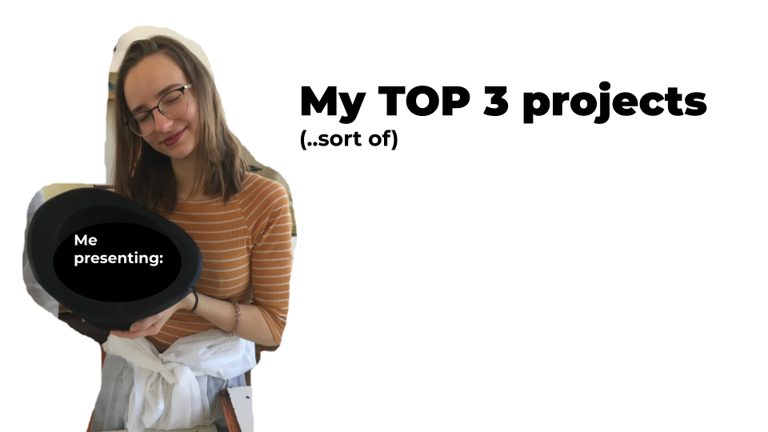

# Impression

## My TOP 3 projects (...sort of)

Introducing a few of my favourite projects - which are not at all big and fancy, but it's stuff I enjoyed working on, as a person who likes various types of illustration and working with text in InDesign.

- [View presentation](pdf/ajovt-impression.pdf)

## (actually playable) gif

### Notes
1. *electricity storage; myths in energetics; on development in accumulation;* Digital illustrations, which we use to promote podcast about energetics on instagram. Adobe Illustrator 
2. A series of worksheets for kids in an elementary school, dealing with multiple topics and subjects (advertisment, fact-checking information in media and so on). Adobe inDesign
3. A short, simple animation of a cat, digitally hand drawn. Adobe Photoshop
