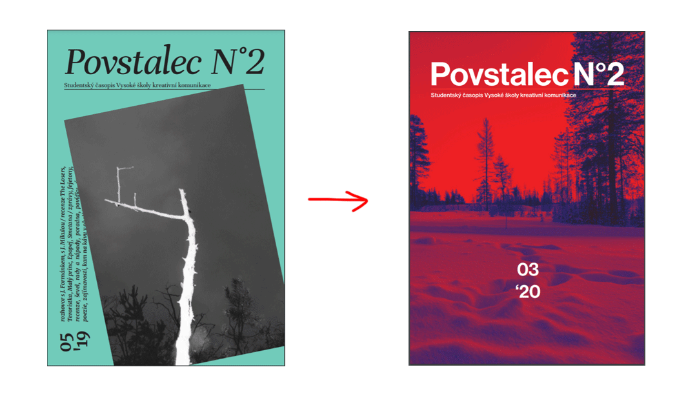
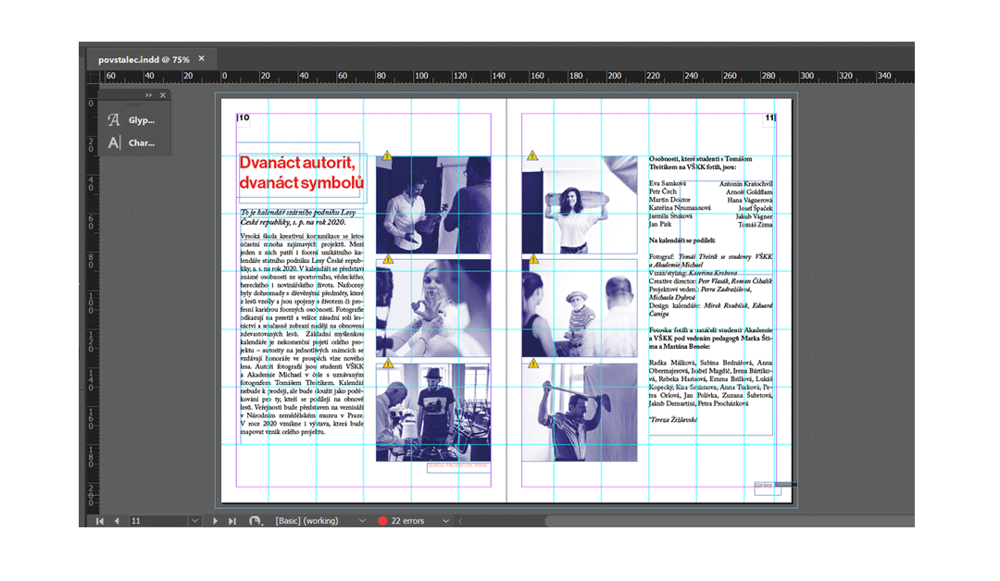
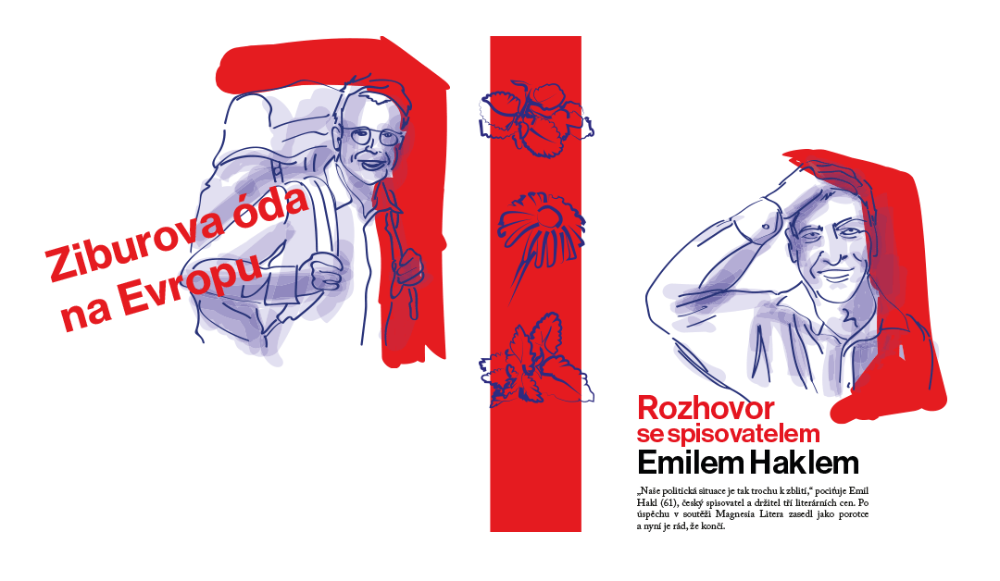

# Povstalec - VŠKK students magazine
## Magazine making from 0 to 100 (or 50) in a month.
This design project was completely accidental on my part. It concerns VŠKK students magazine (at the time I didn't even know we have a magazine). The editorial office lost the graphic designer and was now looking for a designer who would help them with the newest issue (VERY quickly). 

"Hey, that sounds like a great deal." - said me, a graphic design student inexperienced in magazine design, who was avoiding working in InDesign at any cost. So I set up a meeting with the editor in chief and regardless of any concerns about my abilities, I started working.
## week #1

Since the editorial office consists only of literature students, all the design choices and technical processing are now my responsibility. Also, I can't follow the layout of the last published issue. There are too many problems and elements the editorial office isn't satisfied with. So what do I do?

Well, I consulted with my teachers over and over and little by little began to create the magazine from scratch. **Goal?** To create a magazine with a clean and simple (but not dull) design.

## week #2

Time was tight and you can't always wait for your designer to learn how to use the grid correctly. Especially when they already have to figure out basic layouts, type and how to even use InDesign tools. **Priorities.** 

It took a bit of organizing to lay out all the articles and photos and set up basic pagination. Then it was time to choose a nice serif font for text and contrasting font for headlines, one which is easy to use as well. Along with that, we came up with a strict colour scheme - bright red and dark blue - which helped to keep our magazine put together.

## week #3

When we concluded, that we wanted to use illustrations, I was thrilled. Finally something I know how to do. We chose a line art style of digital illustration, following our colour scheme, which played nicely with the mood of the magazine.

## week #4

The moment I finished designing, consulting and adjusting details, it was time for proofreading. Which brought more adjusting. Which brought more proofreading. And more adjusting... And when there was no more proofreading or adjusting, the work was done. Ready to be printed and distributed. 

[The whole magazine to view](https://www.vskk.cz/cz/wp-content/uploads/sites/2/2020/04/povstalec1.final_.web_.pdf)

After that, we published a few more issues of Povstalec. With each one gaining new skills and experience. Right now we are working on better promotion and online presentation and accessibility - there is still a (big) room for improvement.
