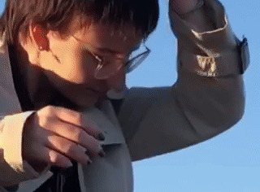

## about me

1. Tried to write a bio
2. Had a breakdown 
3. Bon apetit

*Hana Petržílková - an earthling striving to make things  happen through determination and happy coincidences.*

## my story

I'm your average diversity-in-everything enjoyer. I like my coffee sugary and creamy, like my music, and I like my coffee bitter, also like my music. I like to consume, create, combine and learn as much as I can in the process - which I do mostly on the go.

Given my artistic background, I lean towards illustration and not so strict approach to design. I still find joy in clean and minimalistic stuff, though. Driven to make things <s>pretty</s> work. *At any cost. Not in a rule-breaking way, but definitely a rule-bending way.* Which makes me kind of orderless designer, but it allows me to be a pretty flexible one. 

I worked on several printed matters, including posters, book and magazine layouts, but I also touched upon online banners, logos, social media content and simple animation. Either way, don't you worry I wouldn't know a way to do something, I'm experienced in making my own ways. 
